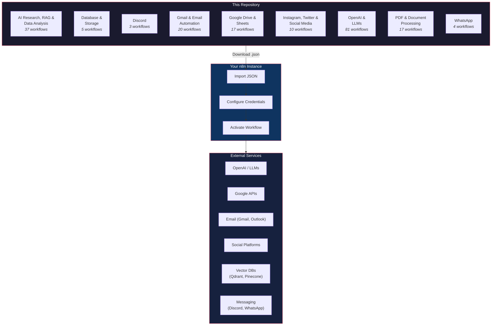

# n8n_automations

A curated library of **194 ready-to-import n8n workflow templates** covering AI/LLMs, email automation, social media, document processing, and more — organized by category so you can find what you need fast.

---

## Why This Exists

| | This Repo | n8n Template Library | Building from Scratch |
|---|---|---|---|
| **Cost** | Free, open-source | Free (but requires n8n account to browse) | Your time |
| **Offline access** | Clone once, use anywhere | Requires internet | N/A |
| **Customizable** | Fork and modify freely | Templates are read-only until imported | Full control |
| **Coverage** | 194 templates across 9 categories | Larger catalog, but harder to browse by use-case | Unlimited, but slow |
| **AI-focused** | Heavy focus on OpenAI, RAG, LLM workflows | General-purpose mix | Depends on your expertise |

**In short:** This repo is for people who want a local, searchable, forkable collection of n8n workflows — especially AI and LLM-heavy ones — without needing to browse the official library one template at a time.

---

## Architecture



---

## Quick Start

1. **Browse** — Find a workflow in the [Categories](#categories--template-list) below or explore the folders directly.
2. **Download** — Click the **Link to Template** for any workflow to view the JSON file, then click the **Raw** button and save it (or clone the entire repo).
3. **Import into n8n** — Open your n8n instance, go to **Workflows → Import from File**, and select the downloaded `.json` file.
4. **Configure Credentials** — Each workflow references credentials (e.g., OpenAI, Gmail, Slack) by ID. Open the imported workflow, click on nodes with a ⚠️ warning, and connect your own credentials.
5. **Activate & Run** — Test the workflow manually first, then toggle it to **Active** when ready.

> **Tip:** New to n8n? Check out the [official n8n documentation](https://docs.n8n.io/) to get your instance up and running.

---

## Common Use Cases

### Auto-label Gmail with AI

Download [`Auto-label incoming Gmail messages with AI nodes.json`](Gmail_and_Email_Automation/Auto-label%20incoming%20Gmail%20messages%20with%20AI%20nodes.json) and import it. This workflow:
- Triggers on every new Gmail message
- Sends the content to an AI model for classification
- Applies labels like `Partnership`, `Inquiry`, `Newsletter` automatically

```
Gmail Trigger → Extract Body → OpenAI Classification → Apply Gmail Label
```

### RAG Chatbot over Your Documents

Download [`RAG Chatbot for Company Documents using Google Drive and Gemini.json`](Google_Drive_and_Google_Sheets/RAG%20Chatbot%20for%20Company%20Documents%20using%20Google%20Drive%20and%20Gemini.json) and import it. This workflow:
- Watches a Google Drive folder for new documents
- Chunks and embeds documents into a vector store
- Exposes a chat interface that answers questions with cited sources

```
Google Drive Trigger → Chunk Documents → Embed (Gemini) → Vector Store → Chat Interface
```

### AI-Powered Discord Bot

Download [`Discord AI-powered bot.json`](Discord/Discord%20AI-powered%20bot.json) and import it. This workflow:
- Listens for messages in Discord channels
- Classifies intent (success story, urgent issue, support ticket)
- Routes to the right department channel automatically

```
Discord Trigger → AI Classification → Route (Success | Urgent | Ticket) → Department Channel
```

---

## Disclaimer

All automation templates in this repository were found online and are uploaded here solely for easy access and sharing. None of the templates are created or owned by the repository author. If you encounter any issues, errors, or damages resulting from the use of these templates, the repository author assumes no responsibility or liability. All rights to the original templates belong to their respective creators.

---

## Categories & Template List

### AI Research, RAG, and Data Analysis

| Title | Description | Link |
|-------|-------------|------|
| 🔍 Perplexity Research to HTML_ AI-Powered Content Creation | Transforms Perplexity AI research into HTML content for AI-powered content creation. | [Link to Template](https://github.com/KazukiNoSuzaku/N8N-Automations/blob/main/AI_Research_RAG_and_Data_Analysis/%F0%9F%94%8D%20Perplexity%20Research%20to%20HTML_%20AI-Powered%20Content%20Creation.json) |
| Analyze tradingview.com charts with Chrome extension, N8N and OpenAI | Analyzes TradingView charts using a Chrome extension, n8n, and OpenAI for automated insights. | [Link to Template](https://github.com/KazukiNoSuzaku/N8N-Automations/blob/main/AI_Research_RAG_and_Data_Analysis/Analyze%20tradingview.com%20charts%20with%20Chrome%20extension%2C%20N8N%20and%20OpenAI.json) |
| Autonomous AI crawler | An autonomous AI-powered web crawler for data collection and analysis. | [Link to Template](https://github.com/KazukiNoSuzaku/N8N-Automations/blob/main/AI_Research_RAG_and_Data_Analysis/Autonomous%20AI%20crawler.json) |
| Build a Financial Documents Assistant using Qdrant and Mistral.ai | Creates an AI assistant for financial document analysis using Qdrant for vector search and Mistral.ai for language processing. | [Link to Template](https://github.com/KazukiNoSuzaku/N8N-Automations/blob/main/AI_Research_RAG_and_Data_Analysis/Build%20a%20Financial%20Documents%20Assistant%20using%20Qdrant%20and%20Mistral.ai.json) |
| Build a Tax Code Assistant with Qdrant, Mistral.ai and OpenAI | Develops an AI assistant for tax code queries using Qdrant, Mistral.ai, and OpenAI for comprehensive responses. | [Link to Template](https://github.com/KazukiNoSuzaku/N8N-Automations/blob/main/AI_Research_RAG_and_Data_Analysis/Build%20a%20Tax%20Code%20Assistant%20with%20Qdrant%2C%20Mistral.ai%20and%20OpenAI.json) |
| Building RAG Chatbot for Movie Recommendations with Qdrant and Open AI | Constructs a RAG-based chatbot for movie recommendations, leveraging Qdrant for retrieval and OpenAI for generation. | [Link to Template](https://github.com/KazukiNoSuzaku/N8N-Automations/blob/main/AI_Research_RAG_and_Data_Analysis/Building%20RAG%20Chatbot%20for%20Movie%20Recommendations%20with%20Qdrant%20and%20Open%20AI.json) |
| Chat with GitHub API Documentation_ RAG-Powered Chatbot with Pinecone & OpenAI | Implements a RAG-powered chatbot for interacting with GitHub API documentation using Pinecone and OpenAI. | [Link to Template](https://github.com/KazukiNoSuzaku/N8N-Automations/blob/main/AI_Research_RAG_and_Data_Analysis/Chat%20with%20GitHub%20API%20Documentation_%20RAG-Powered%20Chatbot%20with%20Pinecone%20%26%20OpenAI.json) |
| Create a Google Analytics Data Report with AI and sent it to E-Mail and Telegram | Generates Google Analytics data reports using AI and sends them via email and Telegram. | [Link to Template](https://github.com/KazukiNoSuzaku/N8N-Automations/blob/main/AI_Research_RAG_and_Data_Analysis/Create%20a%20Google%20Analytics%20Data%20Report%20with%20AI%20and%20sent%20it%20to%20E-Mail%20and%20Telegram.json) |
| Customer Insights with Qdrant, Python and Information Extractor | Extracts customer insights using Qdrant, Python, and an information extraction module. | [Link to Template](https://github.com/KazukiNoSuzaku/N8N-Automations/blob/main/AI_Research_RAG_and_Data_Analysis/Customer%20Insights%20with%20Qdrant%2C%20Python%20and%20Information%20Extractor.json) |
| Deduplicate Scraping AI Grants for Eligibility using AI | Automates the deduplication and eligibility assessment of scraped AI grant data using AI. | [Link to Template](https://github.com/KazukiNoSuzaku/N8N-Automations/blob/main/AI_Research_RAG_and_Data_Analysis/Deduplicate%20Scraping%20AI%20Grants%20for%20Eligibility%20using%20AI.json) |
| Enrich Property Inventory Survey with Image Recognition and AI Agent | Enhances property inventory surveys with image recognition and AI agents for automated data enrichment. | [Link to Template](https://github.com/KazukiNoSuzaku/N8N-Automations/blob/main/AI_Research_RAG_and_Data_Analysis/Enrich%20Property%20Inventory%20Survey%20with%20Image%20Recognition%20and%20AI%20Agent.json) |
| Extract insights & analyse YouTube comments via AI Agent chat | Extracts insights and analyzes YouTube comments through an AI agent chat interface. | [Link to Template](https://github.com/KazukiNoSuzaku/N8N-Automations/blob/main/AI_Research_RAG_and_Data_Analysis/Extract%20insights%20%26%20analyse%20YouTube%20comments%20via%20AI%20Agent%20chat.json) |
| Generate SEO Seed Keywords Using AI | Generates SEO seed keywords using AI to optimize content for search engines. | [Link to Template](https://github.com/KazukiNoSuzaku/N8N-Automations/blob/main/AI_Research_RAG_and_Data_Analysis/Generate%20SEO%20Seed%20Keywords%20Using%20AI.json) |
| Hacker News Job Listing Scraper and Parser | Scrapes and parses job listings from Hacker News for job seekers or recruiters. | [Link to Template](https://github.com/KazukiNoSuzaku/N8N-Automations/blob/main/AI_Research_RAG_and_Data_Analysis/Hacker%20News%20Job%20Listing%20Scraper%20and%20Parser.json) |
| Hacker News to Video Content | Converts Hacker News articles into video content automatically. | [Link to Template](https://github.com/KazukiNoSuzaku/N8N-Automations/blob/main/AI_Research_RAG_and_Data_Analysis/Hacker%20News%20to%20Video%20Content.json) |
| Host Your Own AI Deep Research Agent with n8n, Apify and OpenAI o3 | Sets up a self-hosted AI deep research agent using n8n, Apify, and OpenAI. | [Link to Template](https://github.com/KazukiNoSuzaku/N8N-Automations/blob/main/AI_Research_RAG_and_Data_Analysis/Host%20Your%20Own%20AI%20Deep%20Research%20Agent%20with%20n8n%2C%20Apify%20and%20OpenAI%20o3.json) |
| Intelligent Web Query and Semantic Re-Ranking Flow using Brave and Google Gemini | Performs intelligent web queries and semantic re-ranking using Brave browser and Google Gemini AI. | [Link to Template](https://github.com/KazukiNoSuzaku/N8N-Automations/blob/main/AI_Research_RAG_and_Data_Analysis/Intelligent%20Web%20Query%20and%20Semantic%20Re-Ranking%20Flow%20using%20Brave%20and%20Google%20Gemini.json) |
| Learn Anything from HN - Get Top Resource Recommendations from Hacker News | Extracts top resource recommendations from Hacker News to facilitate learning on any topic. | [Link to Template](https://github.com/KazukiNoSuzaku/N8N-Automations/blob/main/AI_Research_RAG_and_Data_Analysis/Learn%20Anything%20from%20HN%20-%20Get%20Top%20Resource%20Recommendations%20from%20Hacker%20News.json) |
| Make OpenAI Citation for File Retrieval RAG | Generates citations for file retrieval in RAG systems using OpenAI. | [Link to Template](https://github.com/KazukiNoSuzaku/N8N-Automations/blob/main/AI_Research_RAG_and_Data_Analysis/Make%20OpenAI%20Citation%20for%20File%20Retrieval%20RAG.json) |
| Open Deep Research - AI-Powered Autonomous Research Workflow | An AI-powered autonomous workflow for conducting deep research. | [Link to Template](https://github.com/KazukiNoSuzaku/N8N-Automations/blob/main/AI_Research_RAG_and_Data_Analysis/Open%20Deep%20Research%20-%20AI-Powered%20Autonomous%20Research%20Workflow.json) |
| Query Perplexity AI from your n8n workflows | Integrates Perplexity AI into n8n workflows for advanced querying capabilities. | [Link to Template](https://github.com/KazukiNoSuzaku/N8N-Automations/blob/main/AI_Research_RAG_and_Data_Analysis/Query%20Perplexity%20AI%20from%20your%20n8n%20workflows.json) |
| Recipe Recommendations with Qdrant and Mistral | Provides recipe recommendations using Qdrant for vector search and Mistral AI for content generation. | [Link to Template](https://github.com/KazukiNoSuzaku/N8N-Automations/blob/main/AI_Research_RAG_and_Data_Analysis/Recipe%20Recommendations%20with%20Qdrant%20and%20Mistral.json) |
| Reconcile Rent Payments with Local Excel Spreadsheet and OpenAI | Reconciles rent payments by comparing local Excel spreadsheets with data processed by OpenAI. | [Link to Template](https://github.com/KazukiNoSuzaku/N8N-Automations/blob/main/AI_Research_RAG_and_Data_Analysis/Reconcile%20Rent%20Payments%20with%20Local%20Excel%20Spreadsheet%20and%20OpenAI.json) |
| Scrape and summarize posts of a news site without RSS feed using AI and save them to a NocoDB | Scrapes and summarizes news posts without RSS feeds using AI, saving the output to NocoDB. | [Link to Template](https://github.com/KazukiNoSuzaku/N8N-Automations/blob/main/AI_Research_RAG_and_Data_Analysis/Scrape%20and%20summarize%20posts%20of%20a%20news%20site%20without%20RSS%20feed%20using%20AI%20and%20save%20them%20to%20a%20NocoDB.json) |
| Scrape and summarize webpages with AI | Scrapes and summarizes content from webpages using AI. | [Link to Template](https://github.com/KazukiNoSuzaku/N8N-Automations/blob/main/AI_Research_RAG_and_Data_Analysis/Scrape%20and%20summarize%20webpages%20with%20AI.json) |
| Scrape Trustpilot Reviews with DeepSeek, Analyze Sentiment with OpenAI | Scrapes Trustpilot Reviews using DeepSeek and analyzes sentiment with OpenAI. | [Link to Template](https://github.com/KazukiNoSuzaku/N8N-Automations/blob/main/AI_Research_RAG_and_Data_Analysis/Scrape%20Trustpilot%20Reviews%20with%20DeepSeek%2C%20Analyze%20Sentiment%20with%20OpenAI.json) |
| Send Google analytics data to A.I. to analyze then save results in Baserow | Sends Google Analytics data to AI for analysis and saves the results in Baserow. | [Link to Template](https://github.com/KazukiNoSuzaku/N8N-Automations/blob/main/AI_Research_RAG_and_Data_Analysis/Send%20Google%20analytics%20data%20to%20A.I.%20to%20analyze%20then%20save%20results%20in%20Baserow.json) |
| Spot Workplace Discrimination Patterns with AI | Identifies patterns of workplace discrimination using AI-driven analysis. | [Link to Template](https://github.com/KazukiNoSuzaku/N8N-Automations/blob/main/AI_Research_RAG_and_Data_Analysis/Spot%20Workplace%20Discrimination%20Patterns%20with%20AI.json) |
| Summarize SERPBear data with AI (via Openrouter) and save it to Baserow | Summarizes SERPBear data using AI (via Openrouter) and saves the insights to Baserow. | [Link to Template](https://github.com/KazukiNoSuzaku/N8N-Automations/blob/main/AI_Research_RAG_and_Data_Analysis/Summarize%20SERPBear%20data%20with%20AI%20(via%20Openrouter)%20and%20save%20it%20to%20Baserow.json) |
| Summarize Umami data with AI (via Openrouter) and save it to Baserow | Summarizes Umami analytics data using AI (via Openrouter) and saves the insights to Baserow. | [Link to Template](https://github.com/KazukiNoSuzaku/N8N-Automations/blob/main/AI_Research_RAG_and_Data_Analysis/Summarize%20Umami%20data%20with%20AI%20(via%20Openrouter)%20and%20save%20it%20to%20Baserow.json) |
| Survey Insights with Qdrant, Python and Information Extractor | Extracts and analyzes insights from survey data using Qdrant, Python, and an information extractor. | [Link to Template](https://github.com/KazukiNoSuzaku/N8N-Automations/blob/main/AI_Research_RAG_and_Data_Analysis/Survey%20Insights%20with%20Qdrant%2C%20Python%20and%20Information%20Extractor.json) |
| Ultimate Scraper Workflow for n8n | A comprehensive scraping workflow for n8n to extract data from various sources. | [Link to Template](https://github.com/KazukiNoSuzaku/N8N-Automations/blob/main/AI_Research_RAG_and_Data_Analysis/Ultimate%20Scraper%20Workflow%20for%20n8n.json) |
| Vector Database as a Big Data Analysis Tool for AI Agents [1_3 anomaly][1_2 KNN] | Utilizes a vector database for big data analysis, focusing on anomaly detection and KNN classification for AI agents. | [Link to Template](https://github.com/KazukiNoSuzaku/N8N-Automations/blob/main/AI_Research_RAG_and_Data_Analysis/Vector%20Database%20as%20a%20Big%20Data%20Analysis%20Tool%20for%20AI%20Agents%20%5B1_3%20anomaly%5D%5B1_2%20KNN%5D.json) |
| Vector Database as a Big Data Analysis Tool for AI Agents [2_2 KNN] | Continues the use of a vector database for big data analysis, focusing on KNN classification for AI agents. | [Link to Template](https://github.com/KazukiNoSuzaku/N8N-Automations/blob/main/AI_Research_RAG_and_Data_Analysis/Vector%20Database%20as%20a%20Big%20Data%20Analysis%20Tool%20for%20AI%20Agents%20%5B2_2%20KNN%5D.json) |
| Vector Database as a Big Data Analysis Tool for AI Agents [2_3 - anomaly] | Explores the use of a vector database for big data analysis, focusing on anomaly detection for AI agents. | [Link to Template](https://github.com/KazukiNoSuzaku/N8N-Automations/blob/main/AI_Research_RAG_and_Data_Analysis/Vector%20Database%20as%20a%20Big%20Data%20Analysis%20Tool%20for%20AI%20Agents%20%5B2_3%20-%20anomaly%5D.json) |
| Vector Database as a Big Data Analysis Tool for AI Agents [3_3 - anomaly] | Concludes the use of a vector database for big data analysis, focusing on anomaly detection for AI agents. | [Link to Template](https://github.com/KazukiNoSuzaku/N8N-Automations/blob/main/AI_Research_RAG_and_Data_Analysis/Vector%20Database%20as%20a%20Big%20Data%20Analysis%20Tool%20for%20AI%20Agents%20%5B3_3%20-%20anomaly%5D.json) |
| Visual Regression Testing with Apify and AI Vision Model | Performs visual regression testing using Apify and an AI vision model to detect UI changes. | [Link to Template](https://github.com/KazukiNoSuzaku/N8N-Automations/blob/main/AI_Research_RAG_and_Data_Analysis/Visual%20Regression%20Testing%20with%20Apify%20and%20AI%20Vision%20Model.json) |

---

### Database & Storage

| Title | Description | Link |
|-------|-------------|------|
| Chat with Postgresql Database | This workflow enables an AI assistant to chat with a PostgreSQL database, allowing users to query and retrieve data using natural language. It supports custom SQL queries and schema introspection. | [Link to Template](https://github.com/KazukiNoSuzaku/N8N-Automations/blob/main/Database_and_Storage/Chat%20with%20Postgresql%20Database.json) |
| Generate SQL queries from schema only - AI-powered | This workflow uses AI to generate SQL queries based on a given database schema, making it easier to interact with databases without manual query writing. | [Link to Template](https://github.com/KazukiNoSuzaku/N8N-Automations/blob/main/Database_and_Storage/Generate%20SQL%20queries%20from%20schema%20only%20-%20AI-powered.json) |
| MongoDB AI Agent - Intelligent Movie Recommendations | This workflow creates an AI agent that provides intelligent movie recommendations by interacting with a MongoDB database, using aggregation pipelines to fetch relevant movie data. | [Link to Template](https://github.com/KazukiNoSuzaku/N8N-Automations/blob/main/Database_and_Storage/MongoDB%20AI%20Agent%20-%20Intelligent%20Movie%20Recommendations.json) |
| Supabase Insertion & Upsertion & Retrieval | This workflow demonstrates how to perform insertion, upsertion, and retrieval operations with Supabase, specifically for handling vector embeddings and associated metadata. | [Link to Template](https://github.com/KazukiNoSuzaku/N8N-Automations/blob/main/Database_and_Storage/Supabase%20Insertion%20%26%20Upsertion%20%26%20Retrieval.json) |
| Talk to your SQLite database with a LangChain AI Agent | This workflow allows users to interact with a SQLite database using a LangChain AI agent, enabling natural language queries and data retrieval from the database. | [Link to Template](https://github.com/KazukiNoSuzaku/N8N-Automations/blob/main/Database_and_Storage/Talk%20to%20your%20SQLite%20database%20with%20a%20LangChain%20AI%20Agent.json) |

---

### Discord

| Title | Description | Link |
|-------|-------------|------|
| Discord AI-powered bot | This workflow creates an AI-powered Discord bot that categorizes user messages (success story, urgent issue, ticket) and routes them to the appropriate department (customer success, IT, customer support). | [Link to Template](https://github.com/KazukiNoSuzaku/N8N-Automations/blob/main/Discord/Discord%20AI-powered%20bot.json) |
| Send daily translated Calvin and Hobbes Comics to Discord | This workflow automates the daily retrieval of Calvin and Hobbes comics, translates the dialogues into English and Korean (or other languages), and posts them to Discord. | [Link to Template](https://github.com/KazukiNoSuzaku/N8N-Automations/blob/main/Discord/Send%20daily%20translated%20Calvin%20and%20Hobbes%20Comics%20to%20Discord.json) |
| Share YouTube Videos with AI Summaries on Discord | This workflow automatically shares new YouTube videos on Discord along with AI-generated summaries of their content, leveraging caption data. | [Link to Template](https://github.com/KazukiNoSuzaku/N8N-Automations/blob/main/Discord/Share%20YouTube%20Videos%20with%20AI%20Summaries%20on%20Discord.json) |

---

### Gmail & Email Automation

| Title | Description | Link |
|-------|-------------|------|
| 📈 Receive Daily Market News from FT.com to your Microsoft outlook inbox | Extracts financial news from FT.com and delivers daily updates to your Outlook inbox. Automates content extraction and email delivery for timely market insights. | [Link to Template](https://github.com/KazukiNoSuzaku/N8N-Automations/blob/main/Gmail_and_Email_Automation/%F0%9F%93%88%20Receive%20Daily%20Market%20News%20from%20FT.com%20to%20your%20Microsoft%20outlook%20inbox.json) |
| A Very Simple _Human in the Loop_ Email Response System Using AI and IMAP | Implements a simple workflow for human-in-the-loop email responses. Uses IMAP to fetch emails, summarizes content with AI, and drafts professional replies for review before sending. | [Link to Template](https://github.com/KazukiNoSuzaku/N8N-Automations/blob/main/Gmail_and_Email_Automation/A%20Very%20Simple%20_Human%20in%20the%20Loop_%20Email%20Response%20System%20Using%20AI%20and%20IMAP.json) |
| AI-powered email processing autoresponder and response approval (Yes_No) | Processes incoming emails with AI, generates draft responses, and routes them through a human approval step before sending. | [Link to Template](https://github.com/KazukiNoSuzaku/N8N-Automations/blob/main/Gmail_and_Email_Automation/AI-powered%20email%20processing%20autoresponder%20and%20response%20approval%20(Yes_No).json) |
| Analyze & Sort Suspicious Email Contents with ChatGPT | Analyzes suspicious emails using ChatGPT, classifies them, and can generate screenshots for review. Helps identify and sort potentially dangerous emails. | [Link to Template](https://github.com/KazukiNoSuzaku/N8N-Automations/blob/main/Gmail_and_Email_Automation/Analyze%20%26%20Sort%20Suspicious%20Email%20Contents%20with%20ChatGPT.json) |
| Analyze Suspicious Email Contents with ChatGPT Vision | Uses both text and image analysis (ChatGPT Vision) to evaluate suspicious emails. Extracts screenshots, analyzes headers and content, and flags phishing attempts. | [Link to Template](https://github.com/KazukiNoSuzaku/N8N-Automations/blob/main/Gmail_and_Email_Automation/Analyze%20Suspicious%20Email%20Contents%20with%20ChatGPT%20Vision.json) |
| Auto Categorise Outlook Emails with AI | Automatically categorizes Outlook emails using AI models. Moves messages to folders and assigns categories based on content, reducing manual sorting. | [Link to Template](https://github.com/KazukiNoSuzaku/N8N-Automations/blob/main/Gmail_and_Email_Automation/Auto%20Categorise%20Outlook%20Emails%20with%20AI.json) |
| Auto-label incoming Gmail messages with AI nodes | Automatically labels incoming Gmail messages using AI. The workflow retrieves message content, suggests labels like Partnership or Inquiry, and assigns them for better organization. | [Link to Template](https://github.com/KazukiNoSuzaku/N8N-Automations/blob/main/Gmail_and_Email_Automation/Auto-label%20incoming%20Gmail%20messages%20with%20AI%20nodes.json) |
| Basic Automatic Gmail Email Labelling with OpenAI and Gmail API | Uses OpenAI and Gmail API to trigger on new emails, analyze content, and assign or create labels automatically. Helps categorize emails efficiently using AI. | [Link to Template](https://github.com/KazukiNoSuzaku/N8N-Automations/blob/main/Gmail_and_Email_Automation/Basic%20Automatic%20Gmail%20Email%20Labelling%20with%20OpenAI%20and%20Gmail%20API.json) |
| Classify lemlist replies using OpenAI and automate reply handling | Classifies replies from lemlist outreach campaigns using OpenAI and automates follow-up actions based on sentiment. | [Link to Template](https://github.com/KazukiNoSuzaku/N8N-Automations/blob/main/Gmail_and_Email_Automation/Classify%20lemlist%20replies%20using%20OpenAI%20and%20automate%20reply%20handling.json) |
| Compose reply draft in Gmail with OpenAI Assistant | Generates draft replies in Gmail using OpenAI. Triggers on new emails, extracts content, and creates a suggested reply draft to streamline responses. | [Link to Template](https://github.com/KazukiNoSuzaku/N8N-Automations/blob/main/Gmail_and_Email_Automation/Compose%20reply%20draft%20in%20Gmail%20with%20OpenAI%20Assistant.json) |
| create e-mail responses with fastmail and OpenAI | Generates email responses using Fastmail and OpenAI to streamline inbox management. | [Link to Template](https://github.com/KazukiNoSuzaku/N8N-Automations/blob/main/Gmail_and_Email_Automation/create%20e-mail%20responses%20with%20fastmail%20and%20OpenAI.json) |
| Effortless Email Management with AI-Powered Summarization & Review | Summarizes and reviews incoming emails using AI to help users manage their inbox more efficiently. | [Link to Template](https://github.com/KazukiNoSuzaku/N8N-Automations/blob/main/Gmail_and_Email_Automation/Effortless%20Email%20Management%20with%20AI-Powered%20Summarization%20%26%20Review.json) |
| Email Summary Agent | An AI agent that summarizes email threads and highlights key action items. | [Link to Template](https://github.com/KazukiNoSuzaku/N8N-Automations/blob/main/Gmail_and_Email_Automation/Email%20Summary%20Agent.json) |
| Extract spending history from gmail to google sheet | Extracts spending and transaction data from Gmail receipts and logs them into a Google Sheet. | [Link to Template](https://github.com/KazukiNoSuzaku/N8N-Automations/blob/main/Gmail_and_Email_Automation/Extract%20spending%20history%20from%20gmail%20to%20google%20sheet.json) |
| Gmail AI Auto-Responder_ Create Draft Replies to incoming emails | Automatically creates draft replies to incoming Gmail messages using AI-generated responses. | [Link to Template](https://github.com/KazukiNoSuzaku/N8N-Automations/blob/main/Gmail_and_Email_Automation/Gmail%20AI%20Auto-Responder_%20Create%20Draft%20Replies%20to%20incoming%20emails.json) |
| Microsoft Outlook AI Email Assistant with contact support from Monday and Airtable | An AI-powered assistant for Outlook that processes emails, sanitizes content, and assigns categories using rules from Airtable. Integrates with Monday.com for contact support. | [Link to Template](https://github.com/KazukiNoSuzaku/N8N-Automations/blob/main/Gmail_and_Email_Automation/Microsoft%20Outlook%20AI%20Email%20Assistant%20with%20contact%20support%20from%20Monday%20and%20Airtable.json) |
| Modular & Customizable AI-Powered Email Routing_ Text Classifier for eCommerce | Routes incoming eCommerce emails to the right department using an AI-powered text classifier. | [Link to Template](https://github.com/KazukiNoSuzaku/N8N-Automations/blob/main/Gmail_and_Email_Automation/Modular%20%26%20Customizable%20AI-Powered%20Email%20Routing_%20Text%20Classifier%20for%20eCommerce.json) |
| Send a ChatGPT email reply and save responses to Google Sheets | Sends AI-generated email replies via ChatGPT and logs the responses in Google Sheets. | [Link to Template](https://github.com/KazukiNoSuzaku/N8N-Automations/blob/main/Gmail_and_Email_Automation/Send%20a%20ChatGPT%20email%20reply%20and%20save%20responses%20to%20Google%20Sheets.json) |
| Send specific PDF attachments from Gmail to Google Drive using OpenAI | Identifies and sends specific PDF attachments from Gmail to Google Drive using OpenAI for classification. | [Link to Template](https://github.com/KazukiNoSuzaku/N8N-Automations/blob/main/Gmail_and_Email_Automation/Send%20specific%20PDF%20attachments%20from%20Gmail%20to%20Google%20Drive%20using%20OpenAI.json) |
| Summarize your emails with A.I. (via Openrouter) and send to Line messenger | Summarizes emails using AI via Openrouter and sends the summaries to Line messenger. | [Link to Template](https://github.com/KazukiNoSuzaku/N8N-Automations/blob/main/Gmail_and_Email_Automation/Summarize%20your%20emails%20with%20A.I.%20(via%20Openrouter)%20and%20send%20to%20Line%20messenger.json) |

---

### Google Drive & Google Sheets

| Title | Description | Link |
|-------|-------------|------|
| ✨ Vision-Based AI Agent Scraper - with Google Sheets, ScrapingBee, and Gemini | Scrapes web content using a vision-based AI agent with ScrapingBee and Gemini, saving results to Google Sheets. | [Link to Template](https://github.com/KazukiNoSuzaku/N8N-Automations/blob/main/Google_Drive_and_Google_Sheets/%E2%9C%A8%20Vision-Based%20AI%20Agent%20Scraper%20-%20with%20Google%20Sheets%2C%20ScrapingBee%2C%20and%20Gemini.json) |
| Author and Publish Blog Posts From Google Sheets | Enables authoring blog posts in Google Sheets and automatically publishing them to a content management system, simplifying content creation and publishing. | [Link to Template](https://github.com/KazukiNoSuzaku/N8N-Automations/blob/main/Google_Drive_and_Google_Sheets/Author%20and%20Publish%20Blog%20Posts%20From%20Google%20Sheets.json) |
| Automated End-to-End Fine-Tuning of OpenAI Models with Google Drive Integration | Automates the fine-tuning of OpenAI models by integrating with Google Drive for data input and output, streamlining custom AI model training. | [Link to Template](https://github.com/KazukiNoSuzaku/N8N-Automations/blob/main/Google_Drive_and_Google_Sheets/Automated%20End-to-End%20Fine-Tuning%20of%20OpenAI%20Models%20with%20Google%20Drive%20Integration.json) |
| Automatic Background Removal for Images in Google Drive | Automatically removes backgrounds from images stored in Google Drive, preparing them for various uses like product catalogs or marketing materials. | [Link to Template](https://github.com/KazukiNoSuzaku/N8N-Automations/blob/main/Google_Drive_and_Google_Sheets/Automatic%20Background%20Removal%20for%20Images%20in%20Google%20Drive.json) |
| Build an OpenAI Assistant with Google Drive Integration | Demonstrates building an OpenAI Assistant that accesses and utilizes files in Google Drive, enabling it to answer questions or perform tasks based on document content. | [Link to Template](https://github.com/KazukiNoSuzaku/N8N-Automations/blob/main/Google_Drive_and_Google_Sheets/Build%20an%20OpenAI%20Assistant%20with%20Google%20Drive%20Integration.json) |
| Chat with a Google Sheet using AI | Allows users to interact with and query data within a Google Sheet using natural language via an AI model, making data analysis more accessible. | [Link to Template](https://github.com/KazukiNoSuzaku/N8N-Automations/blob/main/Google_Drive_and_Google_Sheets/Chat%20with%20a%20Google%20Sheet%20using%20AI.json) |
| Chat with your event schedule from Google Sheets in Telegram | Connects a Google Sheet containing an event schedule to Telegram, allowing users to query their schedule through a Telegram bot. | [Link to Template](https://github.com/KazukiNoSuzaku/N8N-Automations/blob/main/Google_Drive_and_Google_Sheets/Chat%20with%20your%20event%20schedule%20from%20Google%20Sheets%20in%20Telegram.json) |
| Extract Information from a Logo Sheet using forms, AI, Google Sheet and Airtable | Extracts logo information from forms using AI and saves the data to Google Sheets and Airtable. | [Link to Template](https://github.com/KazukiNoSuzaku/N8N-Automations/blob/main/Google_Drive_and_Google_Sheets/Extract%20Information%20from%20a%20Logo%20Sheet%20using%20forms%2C%20AI%2C%20Google%20Sheet%20and%20Airtable.json) |
| Flux Dev Image Generation (Fal.ai) to Google Drive | Generates images using Flux Dev via Fal.ai and saves them to Google Drive. | [Link to Template](https://github.com/KazukiNoSuzaku/N8N-Automations/blob/main/Google_Drive_and_Google_Sheets/Flux%20Dev%20Image%20Generation%20(Fal.ai)%20to%20Google%20Drive.json) |
| Qualify new leads in Google Sheets via OpenAI_s GPT-4 | Uses OpenAI's GPT-4 to analyze and qualify new leads entered into a Google Sheet, helping sales teams prioritize their outreach. | [Link to Template](https://github.com/KazukiNoSuzaku/N8N-Automations/blob/main/Google_Drive_and_Google_Sheets/Qualify%20new%20leads%20in%20Google%20Sheets%20via%20OpenAI_s%20GPT-4.json) |
| RAG Chatbot for Company Documents using Google Drive and Gemini | Creates a Retrieval-Augmented Generation (RAG) chatbot that answers questions based on company documents stored in Google Drive, leveraging Google Gemini. | [Link to Template](https://github.com/KazukiNoSuzaku/N8N-Automations/blob/main/Google_Drive_and_Google_Sheets/RAG%20Chatbot%20for%20Company%20Documents%20using%20Google%20Drive%20and%20Gemini.json) |
| RAG_Context-Aware Chunking _ Google Drive to Pinecone via OpenRouter & Gemini | Implements context-aware chunking for Google Drive documents, sending them to Pinecone for vector storage and using OpenRouter & Gemini for advanced RAG. | [Link to Template](https://github.com/KazukiNoSuzaku/N8N-Automations/blob/main/Google_Drive_and_Google_Sheets/RAG_Context-Aware%20Chunking%20_%20Google%20Drive%20to%20Pinecone%20via%20OpenRouter%20%26%20Gemini.json) |
| Screen Applicants With AI, notify HR and save them in a Google Sheet | Automates the screening of job applicants using AI, notifies HR of qualified candidates, and saves applicant data into a Google Sheet. | [Link to Template](https://github.com/KazukiNoSuzaku/N8N-Automations/blob/main/Google_Drive_and_Google_Sheets/Screen%20Applicants%20With%20AI%2C%20notify%20HR%20and%20save%20them%20in%20a%20Google%20Sheet.json) |
| Simple Expense Tracker with n8n Chat, AI Agent and Google Sheets | Tracks expenses through an n8n chat interface with an AI agent, logging data to Google Sheets. | [Link to Template](https://github.com/KazukiNoSuzaku/N8N-Automations/blob/main/Google_Drive_and_Google_Sheets/Simple%20Expense%20Tracker%20with%20n8n%20Chat%2C%20AI%20Agent%20and%20Google%20Sheets.json) |
| Summarize Google Sheets form feedback via OpenAI_s GPT-4 | Summarizes feedback collected through Google Forms and stored in Google Sheets using OpenAI's GPT-4, providing quick insights from survey responses. | [Link to Template](https://github.com/KazukiNoSuzaku/N8N-Automations/blob/main/Google_Drive_and_Google_Sheets/Summarize%20Google%20Sheets%20form%20feedback%20via%20OpenAI_s%20GPT-4.json) |
| Summarize the New Documents from Google Drive and Save Summary in Google Sheet | Monitors Google Drive for new documents, summarizes their content using AI, and saves these summaries into a Google Sheet for quick overview and analysis. | [Link to Template](https://github.com/KazukiNoSuzaku/N8N-Automations/blob/main/Google_Drive_and_Google_Sheets/Summarize%20the%20New%20Documents%20from%20Google%20Drive%20and%20Save%20Summary%20in%20Google%20Sheet.json) |
| Upload to Instagram and Tiktok from Google Drive | Automates uploading media from Google Drive directly to Instagram and TikTok, streamlining social media content publishing. | [Link to Template](https://github.com/KazukiNoSuzaku/N8N-Automations/blob/main/Google_Drive_and_Google_Sheets/Upload%20to%20Instagram%20and%20Tiktok%20from%20Google%20Drive.json) |

---

### Instagram, Twitter & Social Media

| Title | Description | Link |
|-------|-------------|------|
| AI agent for Instagram DM_inbox. Manychat + Open AI integration | Integrates Manychat with OpenAI to create an AI agent for managing Instagram direct messages. | [Link to Template](https://github.com/KazukiNoSuzaku/N8N-Automations/blob/main/Instagram_Twitter_Social_Media/AI%20agent%20for%20Instagram%20DM_inbox.%20Manychat%20%2B%20Open%20AI%20integration.json) |
| Create dynamic Twitter profile banner | Automates the creation of dynamic Twitter profile banners. | [Link to Template](https://github.com/KazukiNoSuzaku/N8N-Automations/blob/main/Instagram_Twitter_Social_Media/Create%20dynamic%20Twitter%20profile%20banner.json) |
| Generate Instagram Content from Top Trends with AI Image Generation | Creates Instagram content by analyzing top trends and generating relevant images using AI. | [Link to Template](https://github.com/KazukiNoSuzaku/N8N-Automations/blob/main/Instagram_Twitter_Social_Media/Generate%20Instagram%20Content%20from%20Top%20Trends%20with%20AI%20Image%20Generation.json) |
| OpenAI-powered tweet generator | Generates tweets using OpenAI's language models. | [Link to Template](https://github.com/KazukiNoSuzaku/N8N-Automations/blob/main/Instagram_Twitter_Social_Media/OpenAI-powered%20tweet%20generator.json) |
| Post New YouTube Videos to X | Automatically posts new YouTube videos to X (formerly Twitter). | [Link to Template](https://github.com/KazukiNoSuzaku/N8N-Automations/blob/main/Instagram_Twitter_Social_Media/Post%20New%20YouTube%20Videos%20to%20X.json) |
| Reddit AI digest | Creates an AI-generated digest of Reddit content. | [Link to Template](https://github.com/KazukiNoSuzaku/N8N-Automations/blob/main/Instagram_Twitter_Social_Media/Reddit%20AI%20digest.json) |
| Social Media Analysis and Automated Email Generation | Analyzes social media data and generates automated email reports. | [Link to Template](https://github.com/KazukiNoSuzaku/N8N-Automations/blob/main/Instagram_Twitter_Social_Media/Social%20Media%20Analysis%20and%20Automated%20Email%20Generation.json) |
| Speed Up Social Media Banners With BannerBear.com | Automates the creation of social media banners using BannerBear.com. | [Link to Template](https://github.com/KazukiNoSuzaku/N8N-Automations/blob/main/Instagram_Twitter_Social_Media/Speed%20Up%20Social%20Media%20Banners%20With%20BannerBear.com.json) |
| Twitter Virtual AI Influencer | Manages a virtual AI influencer's Twitter account. | [Link to Template](https://github.com/KazukiNoSuzaku/N8N-Automations/blob/main/Instagram_Twitter_Social_Media/Twitter%20Virtual%20AI%20Influencer.json) |
| Update Twitter banner using HTTP request | Updates a Twitter banner using HTTP requests. | [Link to Template](https://github.com/KazukiNoSuzaku/N8N-Automations/blob/main/Instagram_Twitter_Social_Media/Update%20Twitter%20banner%20using%20HTTP%20request.json) |

---

### OpenAI & LLMs

| Title | Description | Link |
|-------|-------------|------|
| ⚡AI-Powered YouTube Video Summarization & Analysis | Summarizes and analyzes YouTube videos using AI. | [Link to Template](https://github.com/KazukiNoSuzaku/N8N-Automations/blob/main/OpenAI_and_LLMs/%E2%9A%A1AI-Powered%20YouTube%20Video%20Summarization%20%26%20Analysis.json) |
| 🎨 Interactive Image Editor with FLUX.1 Fill Tool for Inpainting | Provides an interactive image editor with FLUX.1 inpainting capabilities for AI-powered image editing. | [Link to Template](https://github.com/KazukiNoSuzaku/N8N-Automations/blob/main/OpenAI_and_LLMs/%F0%9F%8E%A8%20Interactive%20Image%20Editor%20with%20FLUX.1%20Fill%20Tool%20for%20Inpainting.json) |
| 🐋DeepSeek V3 Chat & R1 Reasoning Quick Start | Quick start template for using DeepSeek V3 Chat and R1 Reasoning models in n8n workflows. | [Link to Template](https://github.com/KazukiNoSuzaku/N8N-Automations/blob/main/OpenAI_and_LLMs/%F0%9F%90%8BDeepSeek%20V3%20Chat%20%26%20R1%20Reasoning%20Quick%20Start.json) |
| 📚 Auto-generate documentation for n8n workflows with GPT and Docsify | Automatically generates documentation for n8n workflows using GPT and publishes via Docsify. | [Link to Template](https://github.com/KazukiNoSuzaku/N8N-Automations/blob/main/OpenAI_and_LLMs/%F0%9F%93%9A%20Auto-generate%20documentation%20for%20n8n%20workflows%20with%20GPT%20and%20Docsify.json) |
| 🔐🦙🤖 Private & Local Ollama Self-Hosted AI Assistant | Sets up a private, self-hosted AI assistant using Ollama for local LLM inference. | [Link to Template](https://github.com/KazukiNoSuzaku/N8N-Automations/blob/main/OpenAI_and_LLMs/%F0%9F%94%90%F0%9F%A6%99%F0%9F%A4%96%20Private%20%26%20Local%20Ollama%20Self-Hosted%20AI%20Assistant.json) |
| 🔥📈🤖 AI Agent for n8n Creators Leaderboard - Find Popular Workflows | An AI agent that queries and reports on the n8n creators leaderboard to find popular workflows. | [Link to Template](https://github.com/KazukiNoSuzaku/N8N-Automations/blob/main/OpenAI_and_LLMs/%F0%9F%94%A5%F0%9F%93%88%F0%9F%A4%96%20AI%20Agent%20for%20n8n%20Creators%20Leaderboard%20-%20Find%20Popular%20Workflows.json) |
| 🤖🧑_💻 AI Agent for Top n8n Creators Leaderboard Reporting | An AI agent that generates reports on top n8n workflow creators from the leaderboard. | [Link to Template](https://github.com/KazukiNoSuzaku/N8N-Automations/blob/main/OpenAI_and_LLMs/%F0%9F%A4%96%F0%9F%A7%91_%F0%9F%92%BB%20AI%20Agent%20for%20Top%20n8n%20Creators%20Leaderboard%20Reporting.json) |
| 🚀 Local Multi-LLM Testing & Performance Tracker | Tests and compares multiple local LLMs, tracking performance metrics across models. | [Link to Template](https://github.com/KazukiNoSuzaku/N8N-Automations/blob/main/OpenAI_and_LLMs/%F0%9F%9A%80%20Local%20Multi-LLM%20Testing%20%26%20Performance%20Tracker.json) |
| Actioning Your Meeting Next Steps using Transcripts and AI | Extracts action items from meeting transcripts using AI and creates follow-up tasks. | [Link to Template](https://github.com/KazukiNoSuzaku/N8N-Automations/blob/main/OpenAI_and_LLMs/Actioning%20Your%20Meeting%20Next%20Steps%20using%20Transcripts%20and%20AI.json) |
| Advanced AI Demo (Presented at AI Developers #14 meetup) | Advanced AI capabilities demo. | [Link to Template](https://github.com/KazukiNoSuzaku/N8N-Automations/blob/main/OpenAI_and_LLMs/Advanced%20AI%20Demo%20(Presented%20at%20AI%20Developers%20%2314%20meetup).json) |
| AI Agent _ Google calendar assistant using OpenAI | An AI agent that manages Google Calendar events using OpenAI for scheduling assistance. | [Link to Template](https://github.com/KazukiNoSuzaku/N8N-Automations/blob/main/OpenAI_and_LLMs/AI%20Agent%20_%20Google%20calendar%20assistant%20using%20OpenAI.json) |
| AI agent chat | Basic AI chat agent. | [Link to Template](https://github.com/KazukiNoSuzaku/N8N-Automations/blob/main/OpenAI_and_LLMs/AI%20agent%20chat.json) |
| AI Agent for realtime insights on meetings | Provides real-time AI-powered insights during meetings for better decision-making. | [Link to Template](https://github.com/KazukiNoSuzaku/N8N-Automations/blob/main/OpenAI_and_LLMs/AI%20Agent%20for%20realtime%20insights%20on%20meetings.json) |
| AI agent that can scrape webpages | AI agent for web scraping. | [Link to Template](https://github.com/KazukiNoSuzaku/N8N-Automations/blob/main/OpenAI_and_LLMs/AI%20agent%20that%20can%20scrape%20webpages.json) |
| AI Agent To Chat With Files In Supabase Storage | An AI agent that enables conversational interaction with files stored in Supabase Storage. | [Link to Template](https://github.com/KazukiNoSuzaku/N8N-Automations/blob/main/OpenAI_and_LLMs/AI%20Agent%20To%20Chat%20With%20Files%20In%20Supabase%20Storage.json) |
| AI Agent to chat with Supabase_PostgreSQL DB | An AI agent that allows natural language queries against a Supabase/PostgreSQL database. | [Link to Template](https://github.com/KazukiNoSuzaku/N8N-Automations/blob/main/OpenAI_and_LLMs/AI%20Agent%20to%20chat%20with%20Supabase_PostgreSQL%20DB.json) |
| AI Agent to chat with you Search Console Data, using OpenAI and Postgres | An AI agent that enables conversational queries on Google Search Console data stored in Postgres. | [Link to Template](https://github.com/KazukiNoSuzaku/N8N-Automations/blob/main/OpenAI_and_LLMs/AI%20Agent%20to%20chat%20with%20you%20Search%20Console%20Data%2C%20using%20OpenAI%20and%20Postgres.json) |
| AI Agent with Ollama for current weather and wiki | An AI agent using Ollama that can fetch current weather and Wikipedia information. | [Link to Template](https://github.com/KazukiNoSuzaku/N8N-Automations/blob/main/OpenAI_and_LLMs/AI%20Agent%20with%20Ollama%20for%20current%20weather%20and%20wiki.json) |
| AI Automated HR Workflow for CV Analysis and Candidate Evaluation | Automates HR workflows by analyzing CVs and evaluating candidates using AI. | [Link to Template](https://github.com/KazukiNoSuzaku/N8N-Automations/blob/main/OpenAI_and_LLMs/AI%20Automated%20HR%20Workflow%20for%20CV%20Analysis%20and%20Candidate%20Evaluation.json) |
| AI chat with any data source (using the n8n workflow tool) | Enables AI-powered chat with any data source by leveraging the n8n workflow tool. | [Link to Template](https://github.com/KazukiNoSuzaku/N8N-Automations/blob/main/OpenAI_and_LLMs/AI%20chat%20with%20any%20data%20source%20(using%20the%20n8n%20workflow%20tool).json) |
| AI chatbot that can search the web | An AI chatbot with web search capabilities for answering user queries with up-to-date information. | [Link to Template](https://github.com/KazukiNoSuzaku/N8N-Automations/blob/main/OpenAI_and_LLMs/AI%20chatbot%20that%20can%20search%20the%20web.json) |
| AI Crew to Automate Fundamental Stock Analysis - Q&A Workflow | Stock analysis automation. | [Link to Template](https://github.com/KazukiNoSuzaku/N8N-Automations/blob/main/OpenAI_and_LLMs/AI%20Crew%20to%20Automate%20Fundamental%20Stock%20Analysis%20-%20Q%26A%20Workflow.json) |
| AI Customer feedback sentiment analysis | Sentiment analysis on customer feedback. | [Link to Template](https://github.com/KazukiNoSuzaku/N8N-Automations/blob/main/OpenAI_and_LLMs/AI%20Customer%20feedback%20sentiment%20analysis.json) |
| AI Data Extraction with Dynamic Prompts and Airtable | AI-driven data extraction with Airtable integration. | [Link to Template](https://github.com/KazukiNoSuzaku/N8N-Automations/blob/main/OpenAI_and_LLMs/AI%20Data%20Extraction%20with%20Dynamic%20Prompts%20and%20Airtable.json) |
| AI Data Extraction with Dynamic Prompts and Baserow | AI-driven data extraction with Baserow integration. | [Link to Template](https://github.com/KazukiNoSuzaku/N8N-Automations/blob/main/OpenAI_and_LLMs/AI%20Data%20Extraction%20with%20Dynamic%20Prompts%20and%20Baserow.json) |
| AI Fitness Coach Strava Data Analysis and Personalized Training Insights | Fitness coaching via Strava data analysis. | [Link to Template](https://github.com/KazukiNoSuzaku/N8N-Automations/blob/main/OpenAI_and_LLMs/AI%20Fitness%20Coach%20Strava%20Data%20Analysis%20and%20Personalized%20Training%20Insights.json) |
| AI Powered Web Scraping with Jina, Google Sheets and OpenAI _ the EASY way | Performs AI-powered web scraping using Jina and OpenAI, saving results to Google Sheets. | [Link to Template](https://github.com/KazukiNoSuzaku/N8N-Automations/blob/main/OpenAI_and_LLMs/AI%20Powered%20Web%20Scraping%20with%20Jina%2C%20Google%20Sheets%20and%20OpenAI%20_%20the%20EASY%20way.json) |
| AI Social Media Caption Creator creates social media post captions in Airtable | Generates social media post captions using AI and saves them to Airtable for scheduling. | [Link to Template](https://github.com/KazukiNoSuzaku/N8N-Automations/blob/main/OpenAI_and_LLMs/AI%20Social%20Media%20Caption%20Creator%20creates%20social%20media%20post%20captions%20in%20Airtable.json) |
| AI Voice Chat using Webhook, Memory Manager, OpenAI, Google Gemini & ElevenLabs | Enables AI voice chat using webhooks with memory management, OpenAI, Gemini, and ElevenLabs TTS. | [Link to Template](https://github.com/KazukiNoSuzaku/N8N-Automations/blob/main/OpenAI_and_LLMs/AI%20Voice%20Chat%20using%20Webhook%2C%20Memory%20Manager%2C%20OpenAI%2C%20Google%20Gemini%20%26%20ElevenLabs.json) |
| AI Voice Chatbot with ElevenLabs & OpenAI for Customer Service and Restaurants | Creates an AI voice chatbot for customer service and restaurant ordering using ElevenLabs and OpenAI. | [Link to Template](https://github.com/KazukiNoSuzaku/N8N-Automations/blob/main/OpenAI_and_LLMs/AI%20Voice%20Chatbot%20with%20ElevenLabs%20%26%20OpenAI%20for%20Customer%20Service%20and%20Restaurants.json) |
| AI web researcher for sales | An AI-powered web research agent that gathers prospect intelligence for sales teams. | [Link to Template](https://github.com/KazukiNoSuzaku/N8N-Automations/blob/main/OpenAI_and_LLMs/AI%20web%20researcher%20for%20sales.json) |
| AI Youtube Trend Finder Based On Niche | Finds trending YouTube topics within a specific niche using AI analysis. | [Link to Template](https://github.com/KazukiNoSuzaku/N8N-Automations/blob/main/OpenAI_and_LLMs/AI%20Youtube%20Trend%20Finder%20Based%20On%20Niche.json) |
| AI_ Ask questions about any data source (using the n8n workflow retriever) | Allows users to ask questions about various data sources using an n8n workflow retriever. | [Link to Template](https://github.com/KazukiNoSuzaku/N8N-Automations/blob/main/OpenAI_and_LLMs/AI_%20Ask%20questions%20about%20any%20data%20source%20(using%20the%20n8n%20workflow%20retriever).json) |
| AI_ Summarize podcast episode and enhance using Wikipedia | Summarizes podcast episodes and enhances the summary with information from Wikipedia using AI. | [Link to Template](https://github.com/KazukiNoSuzaku/N8N-Automations/blob/main/OpenAI_and_LLMs/AI_%20Summarize%20podcast%20episode%20and%20enhance%20using%20Wikipedia.json) |
| AI-Driven Lead Management and Inquiry Automation with ERPNext & n8n | Lead management automation. | [Link to Template](https://github.com/KazukiNoSuzaku/N8N-Automations/blob/main/OpenAI_and_LLMs/AI-Driven%20Lead%20Management%20and%20Inquiry%20Automation%20with%20ERPNext%20%26%20n8n.json) |
| AI-Generated Summary Block for WordPress Posts | Automatically generates and adds AI-powered summary blocks to WordPress posts. | [Link to Template](https://github.com/KazukiNoSuzaku/N8N-Automations/blob/main/OpenAI_and_LLMs/AI-Generated%20Summary%20Block%20for%20WordPress%20Posts.json) |
| AI-Powered Candidate Shortlisting Automation for ERPNext | Candidate shortlisting automation. | [Link to Template](https://github.com/KazukiNoSuzaku/N8N-Automations/blob/main/OpenAI_and_LLMs/AI-Powered%20Candidate%20Shortlisting%20Automation%20for%20ERPNext.json) |
| AI-Powered Email Automation for Business_ Summarize & Respond with RAG | Email automation with summarization and response. | [Link to Template](https://github.com/KazukiNoSuzaku/N8N-Automations/blob/main/OpenAI_and_LLMs/AI-Powered%20Email%20Automation%20for%20Business_%20Summarize%20%26%20Respond%20with%20RAG.json) |
| AI-Powered RAG Workflow For Stock Earnings Report Analysis | Stock earnings report analysis with RAG. | [Link to Template](https://github.com/KazukiNoSuzaku/N8N-Automations/blob/main/OpenAI_and_LLMs/AI-Powered%20RAG%20Workflow%20For%20Stock%20Earnings%20Report%20Analysis.json) |
| AI-Powered Social Media Amplifier | Amplifies social media presence using AI. | [Link to Template](https://github.com/KazukiNoSuzaku/N8N-Automations/blob/main/OpenAI_and_LLMs/AI-Powered%20Social%20Media%20Amplifier.json) |
| AI-powered WooCommerce Support-Agent | Creates an AI-powered support agent for WooCommerce stores. | [Link to Template](https://github.com/KazukiNoSuzaku/N8N-Automations/blob/main/OpenAI_and_LLMs/AI-powered%20WooCommerce%20Support-Agent.json) |
| Ask a human for help when the AI doesn_t know the answer | Implements a human-in-the-loop pattern where the AI escalates to a human when it cannot answer. | [Link to Template](https://github.com/KazukiNoSuzaku/N8N-Automations/blob/main/OpenAI_and_LLMs/Ask%20a%20human%20for%20help%20when%20the%20AI%20doesn_t%20know%20the%20answer.json) |
| Automate Customer Support Issue Resolution using AI Text Classifier | Classifies and routes customer support issues using an AI text classifier for faster resolution. | [Link to Template](https://github.com/KazukiNoSuzaku/N8N-Automations/blob/main/OpenAI_and_LLMs/Automate%20Customer%20Support%20Issue%20Resolution%20using%20AI%20Text%20Classifier.json) |
| Automate Image Validation Tasks using AI Vision | Validates images using AI vision models to check quality, content, or compliance. | [Link to Template](https://github.com/KazukiNoSuzaku/N8N-Automations/blob/main/OpenAI_and_LLMs/Automate%20Image%20Validation%20Tasks%20using%20AI%20Vision.json) |
| Automate Your RFP Process with OpenAI Assistants | Streamlines the RFP (Request for Proposal) process using OpenAI Assistants for document analysis and response generation. | [Link to Template](https://github.com/KazukiNoSuzaku/N8N-Automations/blob/main/OpenAI_and_LLMs/Automate%20Your%20RFP%20Process%20with%20OpenAI%20Assistants.json) |
| Chat Assistant (OpenAI assistant) with Postgres Memory And API Calling Capabalities | An OpenAI-based chat assistant with persistent Postgres memory and external API calling capabilities. | [Link to Template](https://github.com/KazukiNoSuzaku/N8N-Automations/blob/main/OpenAI_and_LLMs/Chat%20Assistant%20(OpenAI%20assistant)%20with%20Postgres%20Memory%20And%20API%20Calling%20Capabalities.json) |
| Chat with local LLMs using n8n and Ollama | Enables chat interactions with locally-hosted LLMs through n8n and Ollama integration. | [Link to Template](https://github.com/KazukiNoSuzaku/N8N-Automations/blob/main/OpenAI_and_LLMs/Chat%20with%20local%20LLMs%20using%20n8n%20and%20Ollama.json) |
| Chat with OpenAI Assistant (by adding a memory) | Enhances OpenAI Assistant with persistent memory for context-aware conversations. | [Link to Template](https://github.com/KazukiNoSuzaku/N8N-Automations/blob/main/OpenAI_and_LLMs/Chat%20with%20OpenAI%20Assistant%20(by%20adding%20a%20memory).json) |
| Configure your own Image Creation API Using OpenAI DALLE-3 | Sets up a custom image generation API endpoint using OpenAI DALL-E 3. | [Link to Template](https://github.com/KazukiNoSuzaku/N8N-Automations/blob/main/OpenAI_and_LLMs/Configure%20your%20own%20Image%20Creation%20API%20Using%20OpenAI%20DALLE-3.json) |
| Convert text to speech with OpenAI | Converts text input to speech audio using the OpenAI text-to-speech API. | [Link to Template](https://github.com/KazukiNoSuzaku/N8N-Automations/blob/main/OpenAI_and_LLMs/Convert%20text%20to%20speech%20with%20OpenAI.json) |
| Create a Branded AI-Powered Website Chatbot | Creates a branded, AI-powered chatbot for websites with customizable appearance and behavior. | [Link to Template](https://github.com/KazukiNoSuzaku/N8N-Automations/blob/main/OpenAI_and_LLMs/Create%20a%20Branded%20AI-Powered%20Website%20Chatbot.json) |
| Custom LangChain agent written in JavaScript | Implements a custom LangChain agent written in JavaScript for flexible AI workflows. | [Link to Template](https://github.com/KazukiNoSuzaku/N8N-Automations/blob/main/OpenAI_and_LLMs/Custom%20LangChain%20agent%20written%20in%20JavaScript.json) |
| Daily meetings summarization with Gemini AI | Summarizes daily meeting notes and transcripts using Google Gemini AI. | [Link to Template](https://github.com/KazukiNoSuzaku/N8N-Automations/blob/main/OpenAI_and_LLMs/Daily%20meetings%20summarization%20with%20Gemini%20AI.json) |
| Daily Podcast Summary | Generates daily summaries of podcast episodes using AI for quick listening overviews. | [Link to Template](https://github.com/KazukiNoSuzaku/N8N-Automations/blob/main/OpenAI_and_LLMs/Daily%20Podcast%20Summary.json) |
| Detect hallucinations using specialised Ollama model bespoke-minicheck | Detects AI hallucinations using the specialized bespoke-minicheck model via Ollama. | [Link to Template](https://github.com/KazukiNoSuzaku/N8N-Automations/blob/main/OpenAI_and_LLMs/Detect%20hallucinations%20using%20specialised%20Ollama%20model%20bespoke-minicheck.json) |
| Dynamically generate a webpage from user request using OpenAI Structured Output | Generates dynamic webpages based on user requests using OpenAI Structured Output. | [Link to Template](https://github.com/KazukiNoSuzaku/N8N-Automations/blob/main/OpenAI_and_LLMs/Dynamically%20generate%20a%20webpage%20from%20user%20request%20using%20OpenAI%20Structured%20Output.json) |
| Easy Image Captioning with Gemini 1.5 Pro | Generates image captions using Google Gemini 1.5 Pro multimodal capabilities. | [Link to Template](https://github.com/KazukiNoSuzaku/N8N-Automations/blob/main/OpenAI_and_LLMs/Easy%20Image%20Captioning%20with%20Gemini%201.5%20Pro.json) |
| Enrich FAQ sections on your website pages at scale with AI | Enriches and expands FAQ sections across website pages at scale using AI content generation. | [Link to Template](https://github.com/KazukiNoSuzaku/N8N-Automations/blob/main/OpenAI_and_LLMs/Enrich%20FAQ%20sections%20on%20your%20website%20pages%20at%20scale%20with%20AI.json) |
| Extract personal data with self-hosted LLM Mistral NeMo | Extracts personal data from documents using a self-hosted Mistral NeMo LLM for privacy-compliant processing. | [Link to Template](https://github.com/KazukiNoSuzaku/N8N-Automations/blob/main/OpenAI_and_LLMs/Extract%20personal%20data%20with%20self-hosted%20LLM%20Mistral%20NeMo.json) |
| Fetch Dynamic Prompts from GitHub and Auto-Populate n8n Expressions in Prompt | Fetches dynamic prompt templates from GitHub and auto-populates n8n expressions within them. | [Link to Template](https://github.com/KazukiNoSuzaku/N8N-Automations/blob/main/OpenAI_and_LLMs/Fetch%20Dynamic%20Prompts%20from%20GitHub%20and%20Auto-Populate%20n8n%20Expressions%20in%20Prompt.json) |
| Flux AI Image Generator | Generates images using the Flux AI model for creative and design workflows. | [Link to Template](https://github.com/KazukiNoSuzaku/N8N-Automations/blob/main/OpenAI_and_LLMs/Flux%20AI%20Image%20Generator.json) |
| Force AI to use a specific output format | Demonstrates techniques to force AI models to output responses in a specific structured format. | [Link to Template](https://github.com/KazukiNoSuzaku/N8N-Automations/blob/main/OpenAI_and_LLMs/Force%20AI%20to%20use%20a%20specific%20output%20format.json) |
| Generate 9_16 Images from Content and Brand Guidelines | Generates 9:16 portrait images from content based on brand guidelines for social media. | [Link to Template](https://github.com/KazukiNoSuzaku/N8N-Automations/blob/main/OpenAI_and_LLMs/Generate%209_16%20Images%20from%20Content%20and%20Brand%20Guidelines.json) |
| Generate audio from text using OpenAI and Webhook _ Text to Speech Workflow | Converts text to audio via OpenAI TTS triggered by webhook requests. | [Link to Template](https://github.com/KazukiNoSuzaku/N8N-Automations/blob/main/OpenAI_and_LLMs/Generate%20audio%20from%20text%20using%20OpenAI%20and%20Webhook%20_%20Text%20to%20Speech%20Workflow.json) |
| Generate Text-to-Speech Using Elevenlabs via API | Generates realistic text-to-speech audio using the ElevenLabs API. | [Link to Template](https://github.com/KazukiNoSuzaku/N8N-Automations/blob/main/OpenAI_and_LLMs/Generate%20Text-to-Speech%20Using%20Elevenlabs%20via%20API.json) |
| Generating Image Embeddings via Textual Summarisation | Creates image embeddings by first generating textual summaries and then converting them to vector representations. | [Link to Template](https://github.com/KazukiNoSuzaku/N8N-Automations/blob/main/OpenAI_and_LLMs/Generating%20Image%20Embeddings%20via%20Textual%20Summarisation.json) |
| lemlist __ GPT-3_ Supercharge your sales workflows | Supercharges sales outreach workflows by integrating lemlist with GPT-3 for personalized messaging. | [Link to Template](https://github.com/KazukiNoSuzaku/N8N-Automations/blob/main/OpenAI_and_LLMs/lemlist%20__%20GPT-3_%20Supercharge%20your%20sales%20workflows.json) |
| Narrating over a Video using Multimodal AI | Generates narration for video content using multimodal AI that understands visual context. | [Link to Template](https://github.com/KazukiNoSuzaku/N8N-Automations/blob/main/OpenAI_and_LLMs/Narrating%20over%20a%20Video%20using%20Multimodal%20AI.json) |
| OpenAI assistant with custom tools | Creates an OpenAI Assistant with custom tool integrations for extended functionality. | [Link to Template](https://github.com/KazukiNoSuzaku/N8N-Automations/blob/main/OpenAI_and_LLMs/OpenAI%20assistant%20with%20custom%20tools.json) |
| OpenAI Assistant workflow_ upload file, create an Assistant, chat with it! | End-to-end workflow to upload files, create an OpenAI Assistant, and start a chat session. | [Link to Template](https://github.com/KazukiNoSuzaku/N8N-Automations/blob/main/OpenAI_and_LLMs/OpenAI%20Assistant%20workflow_%20upload%20file%2C%20create%20an%20Assistant%2C%20chat%20with%20it!.json) |
| OpenAI examples_ ChatGPT, DALLE-2, Whisper-1 – 5-in-1 | Demonstrates five OpenAI capabilities in one workflow: ChatGPT, DALL-E 2, and Whisper-1. | [Link to Template](https://github.com/KazukiNoSuzaku/N8N-Automations/blob/main/OpenAI_and_LLMs/OpenAI%20examples_%20ChatGPT%2C%20DALLE-2%2C%20Whisper-1%20%E2%80%93%205-in-1.json) |
| Organise Your Local File Directories With AI | Uses AI to intelligently organize and restructure local file directories. | [Link to Template](https://github.com/KazukiNoSuzaku/N8N-Automations/blob/main/OpenAI_and_LLMs/Organise%20Your%20Local%20File%20Directories%20With%20AI.json) |
| Personal Shopper Chatbot for WooCommerce with RAG using Google Drive and openAI | Creates a personal shopper chatbot for WooCommerce stores using RAG with Google Drive and OpenAI. | [Link to Template](https://github.com/KazukiNoSuzaku/N8N-Automations/blob/main/OpenAI_and_LLMs/Personal%20Shopper%20Chatbot%20for%20WooCommerce%20with%20RAG%20using%20Google%20Drive%20and%20openAI.json) |
| Prompt-based Object Detection with Gemini 2.0 | Performs prompt-based object detection in images using Google Gemini 2.0 multimodal AI. | [Link to Template](https://github.com/KazukiNoSuzaku/N8N-Automations/blob/main/OpenAI_and_LLMs/Prompt-based%20Object%20Detection%20with%20Gemini%202.0.json) |
| Proxmox AI Agent with n8n and Generative AI Integration | Manages Proxmox virtual environments using an AI agent integrated with generative AI. | [Link to Template](https://github.com/KazukiNoSuzaku/N8N-Automations/blob/main/OpenAI_and_LLMs/Proxmox%20AI%20Agent%20with%20n8n%20and%20Generative%20AI%20Integration.json) |
| Query n8n Credentials with AI SQL Agent | Queries n8n credential data using an AI-powered SQL agent for administration tasks. | [Link to Template](https://github.com/KazukiNoSuzaku/N8N-Automations/blob/main/OpenAI_and_LLMs/Query%20n8n%20Credentials%20with%20AI%20SQL%20Agent.json) |
| Suggest meeting slots using AI | Uses AI to analyze calendars and suggest optimal meeting time slots. | [Link to Template](https://github.com/KazukiNoSuzaku/N8N-Automations/blob/main/OpenAI_and_LLMs/Suggest%20meeting%20slots%20using%20AI.json) |
| Summarize YouTube Videos from Transcript | Summarizes YouTube videos by extracting and processing their transcripts with AI. | [Link to Template](https://github.com/KazukiNoSuzaku/N8N-Automations/blob/main/OpenAI_and_LLMs/Summarize%20YouTube%20Videos%20from%20Transcript.json) |
| Transform Image to Lego Style Using Line and Dall-E | Transforms images into Lego-style artwork using Line messaging and DALL-E image generation. | [Link to Template](https://github.com/KazukiNoSuzaku/N8N-Automations/blob/main/OpenAI_and_LLMs/Transform%20Image%20to%20Lego%20Style%20Using%20Line%20and%20Dall-E.json) |
| Translate audio using AI | Translates audio content between languages using AI-powered transcription and translation. | [Link to Template](https://github.com/KazukiNoSuzaku/N8N-Automations/blob/main/OpenAI_and_LLMs/Translate%20audio%20using%20AI.json) |
| Use OpenRouter in n8n versions _1.78 | Demonstrates how to configure and use OpenRouter as an LLM provider in n8n versions below 1.78. | [Link to Template](https://github.com/KazukiNoSuzaku/N8N-Automations/blob/main/OpenAI_and_LLMs/Use%20OpenRouter%20in%20n8n%20versions%20_1.78.json) |

---

### PDF & Document Processing

| Title | Description | Link |
|-------|-------------|------|
| Ask questions about a PDF using AI | This workflow fetches a PDF from Google Drive, splits it into chunks, embeds the chunks using OpenAI embeddings, and enables chat interactions with the document content. | [Link to Template](https://github.com/KazukiNoSuzaku/N8N-Automations/blob/main/PDF_and_Document_Processing/Ask%20questions%20about%20a%20PDF%20using%20AI.json) |
| Breakdown Documents into Study Notes using Templating MistralAI and Qdrant | This workflow triggers on new files, processes documents with MistralAI embeddings, and stores data in Qdrant vector store for study note generation. | [Link to Template](https://github.com/KazukiNoSuzaku/N8N-Automations/blob/main/PDF_and_Document_Processing/Breakdown%20Documents%20into%20Study%20Notes%20using%20Templating%20MistralAI%20and%20Qdrant.json) |
| Chat with PDF docs using AI (quoting sources) | This workflow enables chat interactions with PDF documents, allowing users to ask questions and receive answers with quoted sources from the document. | [Link to Template](https://github.com/KazukiNoSuzaku/N8N-Automations/blob/main/PDF_and_Document_Processing/Chat%20with%20PDF%20docs%20using%20AI%20(quoting%20sources).json) |
| Convert URL HTML to Markdown Format and Get Page Links | This workflow converts HTML content from a given URL into Markdown format and extracts all page links, useful for content scraping and analysis. | [Link to Template](https://github.com/KazukiNoSuzaku/N8N-Automations/blob/main/PDF_and_Document_Processing/Convert%20URL%20HTML%20to%20Markdown%20Format%20and%20Get%20Page%20Links.json) |
| CV Resume PDF Parsing with Multimodal Vision AI | This workflow converts candidate resume PDFs to images, uses a Vision Language Model to assess candidate fit, and includes logic to bypass hidden AI prompts in resumes. | [Link to Template](https://github.com/KazukiNoSuzaku/N8N-Automations/blob/main/PDF_and_Document_Processing/CV%20Resume%20PDF%20Parsing%20with%20Multimodal%20Vision%20AI.json) |
| ETL pipeline for text processing | This workflow implements an ETL pipeline for text processing, extracting data from Twitter, storing it in MongoDB and PostgreSQL, and sending alerts to Slack based on sentiment analysis. | [Link to Template](https://github.com/KazukiNoSuzaku/N8N-Automations/blob/main/PDF_and_Document_Processing/ETL%20pipeline%20for%20text%20processing.json) |
| Extract and process information directly from PDF using Claude and Gemini | This workflow extracts and processes information directly from PDFs using advanced AI models like Claude and Gemini, enabling intelligent document analysis. | [Link to Template](https://github.com/KazukiNoSuzaku/N8N-Automations/blob/main/PDF_and_Document_Processing/Extract%20and%20process%20information%20directly%20from%20PDF%20using%20Claude%20and%20Gemini.json) |
| Extract data from resume and create PDF with Gotenberg | This workflow extracts structured data from resumes using AI, converts it into HTML, and then generates a well-formatted PDF using Gotenberg. | [Link to Template](https://github.com/KazukiNoSuzaku/N8N-Automations/blob/main/PDF_and_Document_Processing/Extract%20data%20from%20resume%20and%20create%20PDF%20with%20Gotenberg.json) |
| Extract license plate number from image uploaded via an n8n form | This workflow extracts license plate numbers from images uploaded via an n8n form using a Vision Language Model, then displays the extracted information. | [Link to Template](https://github.com/KazukiNoSuzaku/N8N-Automations/blob/main/PDF_and_Document_Processing/Extract%20license%20plate%20number%20from%20image%20uploaded%20via%20an%20n8n%20form.json) |
| Extract text from PDF and image using Vertex AI (Gemini) into CSV | This workflow extracts text from PDFs and images using Vertex AI (Gemini), routes based on file type, and converts the extracted data into a CSV format. | [Link to Template](https://github.com/KazukiNoSuzaku/N8N-Automations/blob/main/PDF_and_Document_Processing/Extract%20text%20from%20PDF%20and%20image%20using%20Vertex%20AI%20(Gemini)%20into%20CSV.json) |
| Invoice data extraction with LlamaParse and OpenAI | This workflow extracts structured data from invoices using LlamaParse and OpenAI, then processes it with a structured output parser for detailed invoice data extraction. | [Link to Template](https://github.com/KazukiNoSuzaku/N8N-Automations/blob/main/PDF_and_Document_Processing/Invoice%20data%20extraction%20with%20LlamaParse%20and%20OpenAI.json) |
| Manipulate PDF with Adobe developer API | Manipulates and processes PDF documents using the Adobe Developer API. | [Link to Template](https://github.com/KazukiNoSuzaku/N8N-Automations/blob/main/PDF_and_Document_Processing/Manipulate%20PDF%20with%20Adobe%20developer%20API.json) |
| Parse PDF with LlamaParse and save to Airtable | Parses PDF documents using LlamaParse and saves the extracted data to Airtable. | [Link to Template](https://github.com/KazukiNoSuzaku/N8N-Automations/blob/main/PDF_and_Document_Processing/Parse%20PDF%20with%20LlamaParse%20and%20save%20to%20Airtable.json) |
| Prepare CSV files with GPT-4 | Prepares and formats CSV files using GPT-4 for data cleaning and transformation. | [Link to Template](https://github.com/KazukiNoSuzaku/N8N-Automations/blob/main/PDF_and_Document_Processing/Prepare%20CSV%20files%20with%20GPT-4.json) |
| Remove Personally Identifiable Information (PII) from CSV Files with OpenAI | Removes personally identifiable information from CSV files using OpenAI for data anonymization. | [Link to Template](https://github.com/KazukiNoSuzaku/N8N-Automations/blob/main/PDF_and_Document_Processing/Remove%20Personally%20Identifiable%20Information%20(PII)%20from%20CSV%20Files%20with%20OpenAI.json) |
| Transcribe Audio Files, Summarize with GPT-4, and Store in Notion | Transcribes audio files, summarizes them with GPT-4, and stores the results in Notion. | [Link to Template](https://github.com/KazukiNoSuzaku/N8N-Automations/blob/main/PDF_and_Document_Processing/Transcribe%20Audio%20Files%2C%20Summarize%20with%20GPT-4%2C%20and%20Store%20in%20Notion.json) |
| Transcribing Bank Statements To Markdown Using Gemini Vision AI | Transcribes bank statements into Markdown format using Gemini Vision AI for document digitization. | [Link to Template](https://github.com/KazukiNoSuzaku/N8N-Automations/blob/main/PDF_and_Document_Processing/Transcribing%20Bank%20Statements%20To%20Markdown%20Using%20Gemini%20Vision%20AI.json) |

---

### WhatsApp

| Title | Description | Link |
|-------|-------------|------|
| Automate Sales Meeting Prep with AI & APIFY Sent To WhatsApp | This workflow automates sales meeting preparation using AI and Apify, sending relevant information to WhatsApp. | [Link to Template](https://github.com/KazukiNoSuzaku/N8N-Automations/blob/main/WhatsApp/Automate%20Sales%20Meeting%20Prep%20with%20AI%20%26%20APIFY%20Sent%20To%20WhatsApp.json) |
| Building Your First WhatsApp Chatbot | This workflow guides you through building your first WhatsApp chatbot. | [Link to Template](https://github.com/KazukiNoSuzaku/N8N-Automations/blob/main/WhatsApp/Building%20Your%20First%20WhatsApp%20Chatbot.json) |
| Complete business WhatsApp AI-Powered RAG Chatbot using OpenAI | This workflow builds a complete business WhatsApp AI-powered RAG chatbot using OpenAI. | [Link to Template](https://github.com/KazukiNoSuzaku/N8N-Automations/blob/main/WhatsApp/Complete%20business%20WhatsApp%20AI-Powered%20RAG%20Chatbot%20using%20OpenAI.json) |
| Respond to WhatsApp Messages with AI Like a Pro! | This workflow enables professional AI-powered responses to WhatsApp messages. | [Link to Template](https://github.com/KazukiNoSuzaku/N8N-Automations/blob/main/WhatsApp/Respond%20to%20WhatsApp%20Messages%20with%20AI%20Like%20a%20Pro!.json) |

---

**Total workflow templates: 194**
